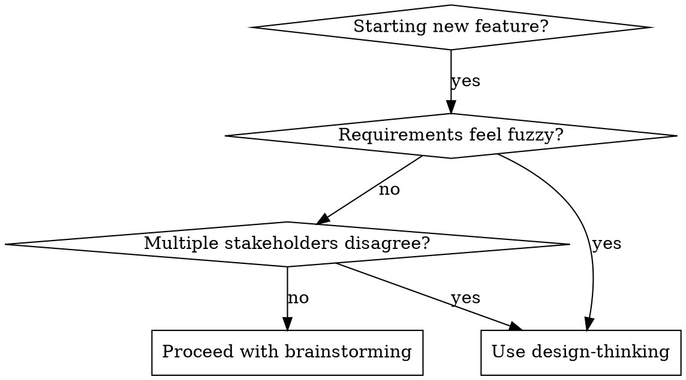

# Design Thinking: First Principles for Software Design

## Overview

Apply three core thinking tools to software design: Socratic questioning to clarify, first principles to find essence, Occam's razor to simplify. Use before or during brainstorming when complexity feels overwhelming.

**REQUIRED BACKGROUND:** You MUST understand superpowers:brainstorming before using this skill. This skill enhances the questioning phase, not replaces the full brainstorming workflow.

## When to Use



## The Three Tools

### 1. Socratic Questioning — Clarify Before Designing

**Purpose:** Strip away assumptions and get to the real problem.

**Process:** Ask 3+ layers of "why" before proposing solutions.

| Level | Question | Goal |
|-------|----------|------|
| 1 | "What specific problem are we solving?" | Surface-level understanding |
| 2 | "Why is that a problem? What happens if we don't solve it?" | Identify pain severity |
| 3 | "Who has this problem and when?" | Define scope and context |
| 4 | "What would success look like? How would we know?" | Establish measurable criteria |

**Red Flags — Keep Digging:**
- Answers contain "I think..." or "Probably..."
- Stakeholders give conflicting answers
- The "problem" is actually a solution ("We need a dashboard" vs "We need visibility into X")

### 2. First Principles — Find the Essence

**Purpose:** Avoid copying competitors or following patterns blindly.

**Process:** Strip away analogy and convention, rebuild from fundamentals.

**Template:**
```
Current framing: "We should build X because [competitor] has it"

First principles reframing:
- What is the fundamental need? (not the feature)
- What are the physical/technical constraints? (unchangeable facts)
- What is the simplest system that meets the need?
```

**Example:**
- ❌ "We need a real-time chat like Slack"
- ✅ "Users need to coordinate quickly. Real-time is one way. Async updates with smart notifications might be simpler and sufficient."

### 3. Occam's Razor — Ruthlessly Simplify

**Purpose:** Align with YAGNI (You Aren't Gonna Need It) principle.

**Process:** After identifying the essential need, choose the simplest implementation.

**Checklist for Every Design Decision:**
- [ ] Does this feature solve the core problem, or a nice-to-have?
- [ ] Can we achieve the goal with existing tools/infrastructure?
- [ ] Is there a simpler way to get 80% of the value?
- [ ] What can we remove without breaking the core use case?

**Hard Gate:**
If you can't explain the design in 2 sentences, it's too complex. Simplify.

## Integration with Brainstorming

### Before Brainstorming

Use design-thinking when the user says something like:
- "I want to build a system that..."
- "We need to add X feature..."
- "The users are complaining about..."

**Process:**
1. Run through Socratic questions (2-3 minutes)
2. Reframe using first principles if needed
3. Present clarified problem to user for confirmation
4. Then invoke brainstorming with the clean problem statement

### During Brainstorming

At the "Ask clarifying questions" step:
- Use Socratic questioning instead of generic questions
- When proposing 2-3 approaches, apply first principles to each
- Before finalizing design, run Occam's razor checklist

### After Brainstorming

Before writing the design doc:
- Review: Did we add anything non-essential?
- Can we remove a component and still meet the core need?

## Common Rationalizations to Ignore

| Excuse | Reality |
|--------|---------|
| "Users might want..." | Build for known needs, not hypothetical ones |
| "We might need to scale..." | Optimize for current scale, refactor when needed |
| "Other products have..." | Competitor features ≠ your user needs |
| "It's just a small addition..." | Small additions accumulate into big complexity |

## Quick Reference

**When stuck, ask:**
1. What is the simplest version that solves the core problem?
2. If we had to launch tomorrow, what would we cut?
3. Are we solving the right problem, or just a symptom?

**Design doc checkpoint:**
- Can explain the design in 2 sentences? → Yes = proceed
- Every component maps to a core need? → Yes = proceed
- Removed at least one "nice-to-have"? → Yes = proceed

## STOP: Before Implementation

**You MUST verify:**
- [ ] Problem is clarified through Socratic questioning
- [ ] Solution is derived from first principles, not analogy
- [ ] Design passes Occam's razor (no unnecessary components)
- [ ] Design is approved by user

**Then and only then:** Invoke brainstorming or proceed with existing workflow.
